# XTRKT

## Work Flow

The landing page of the website is given below. It contains a brief description of the project and also gives the user the option to upload a folder containing the dataset to be processed.

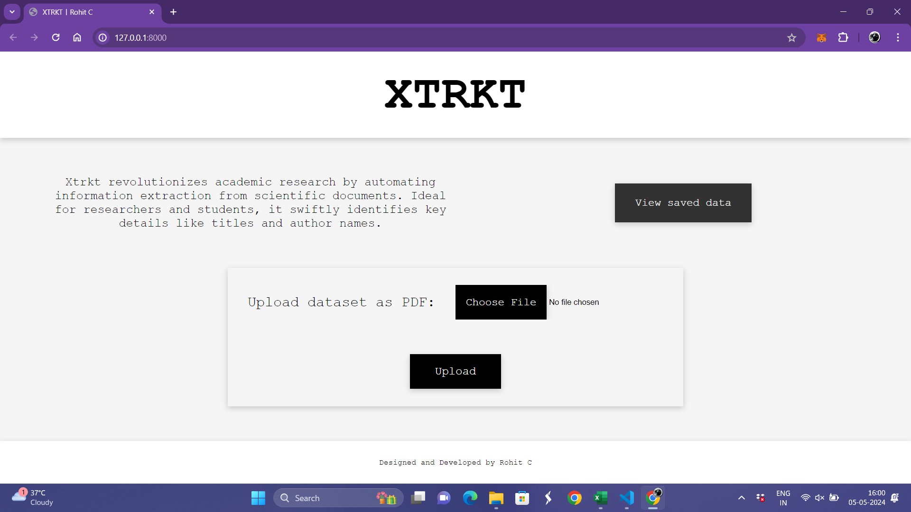

The upload button gives the user the option to choose the specified pdf containing the data as depicted below.

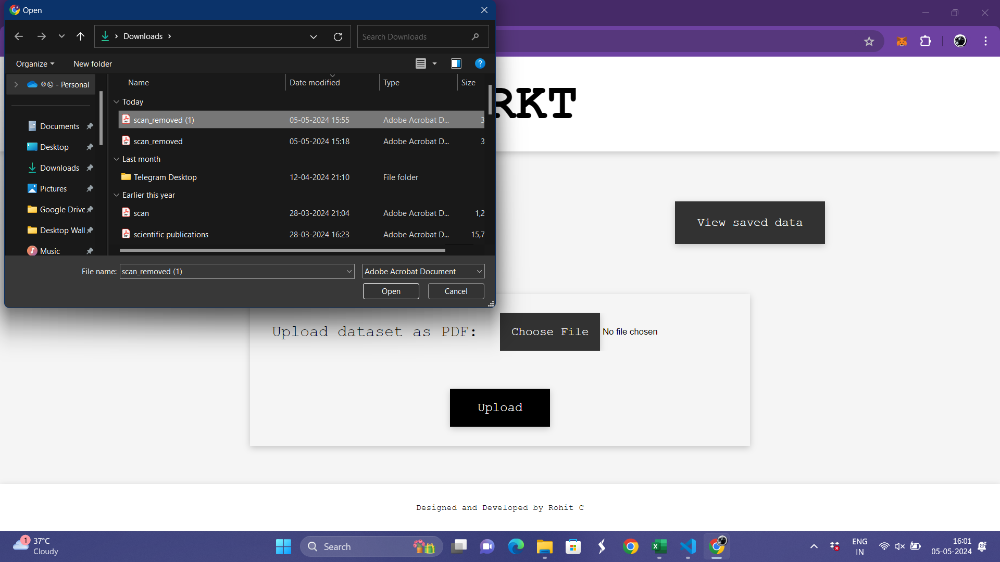

The processing of the dataset takes place inside the upload() function in the views.py file within the task folder of the project.
The images are parsed one by one and passed to the OCR module of the project and the text extracted by it to the Gemini API via prompts.
LLM returns the data that need to be generated related to the content provided.
These values are then stored in the Output table of the database.

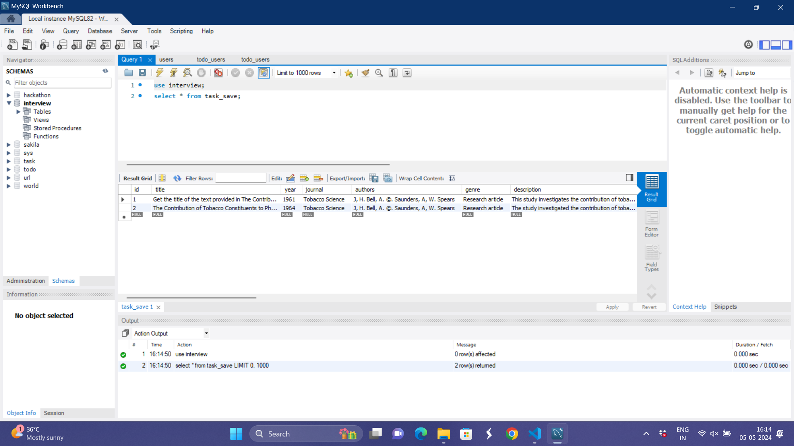

Further on this data is integrated into the frontend to display the output in the specified format to the users where they can edit it accordingly.

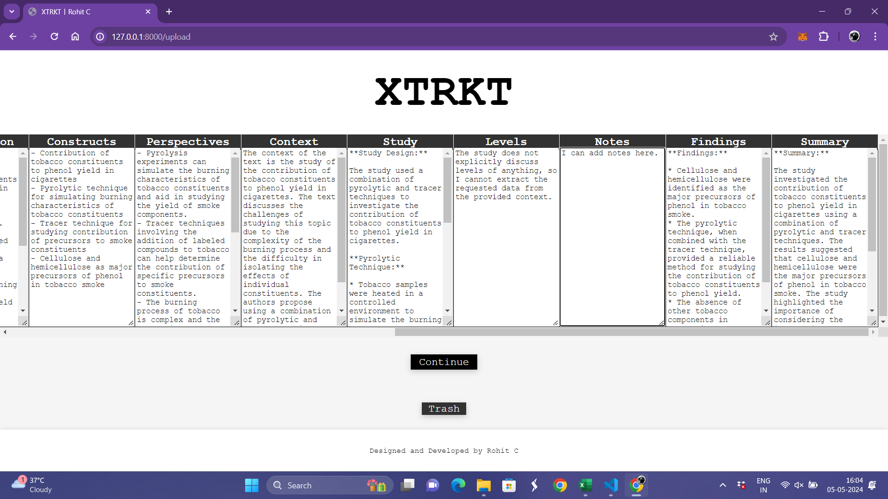

Now the users can either trash the extracts or continue to enter their research.

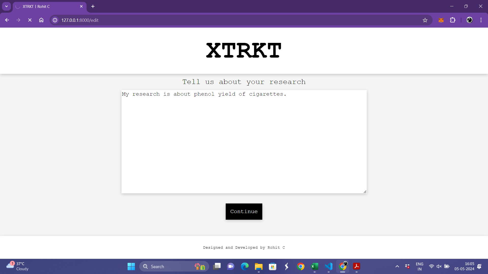

The users now obtain an additional view of the extracted data along with its relation to their research.

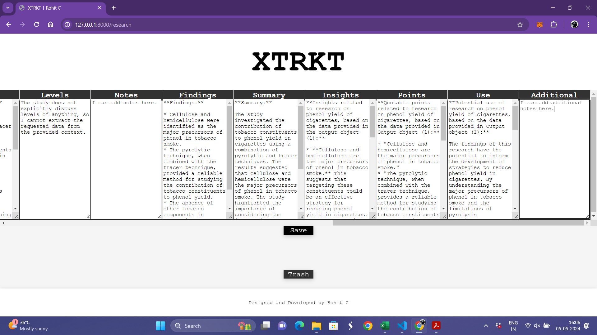

The users can now choose to save the data permanently or trash it entirely.

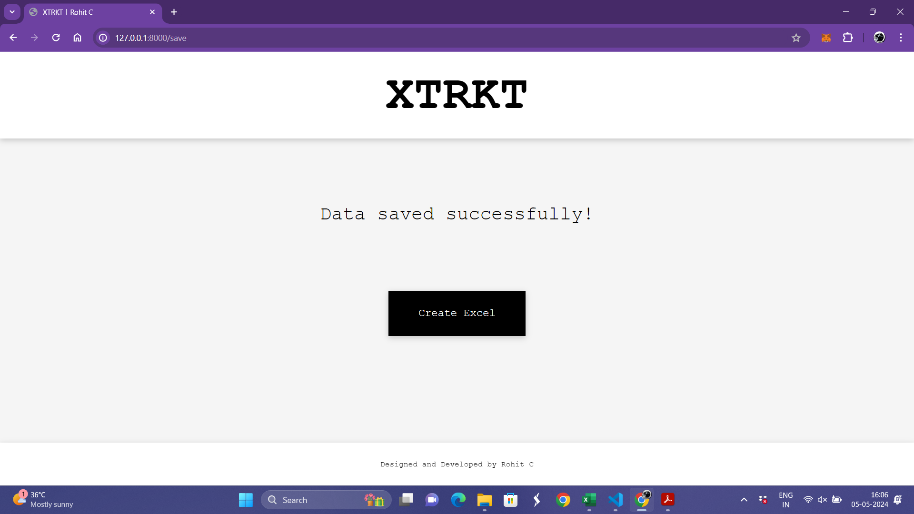

The user is also provided with an option to create an Excel sheet format of the output being displayed by the click of a button.

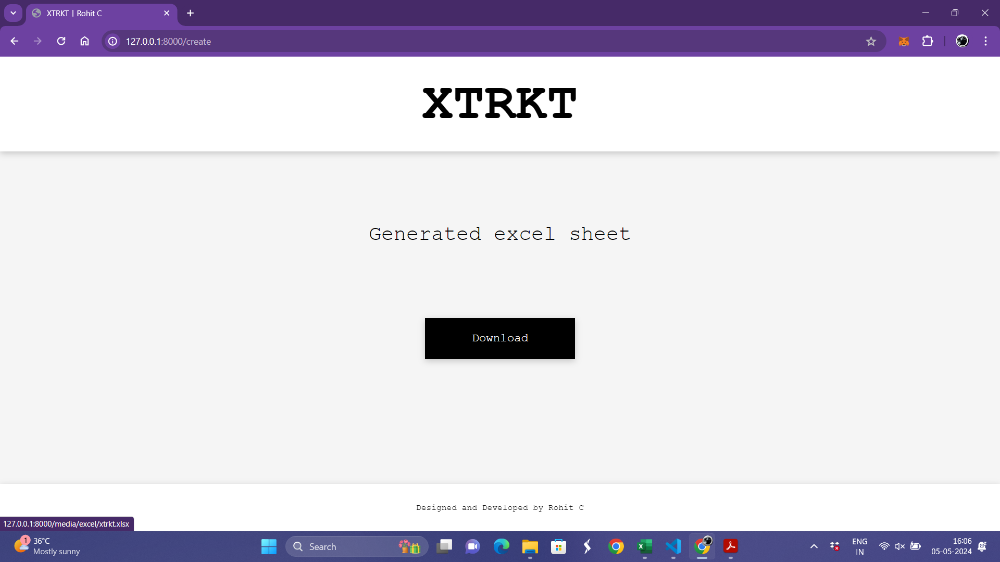

The excel sheet is created in the excel folder within the media directory of the project.
The user now gets the option to download the excel file onto his/her local system.

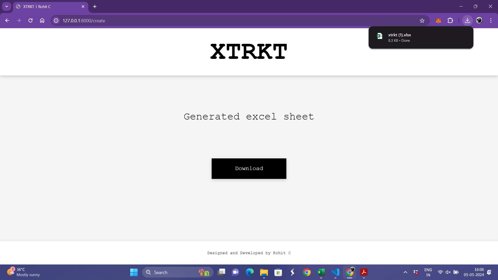

The downloaded .xlsx file can be viewed on any excel sheet view supported platforms.

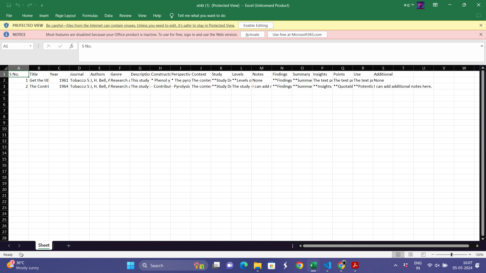

The users can also view all the data saved so far by clicking the 'View saved data' button on the home page.

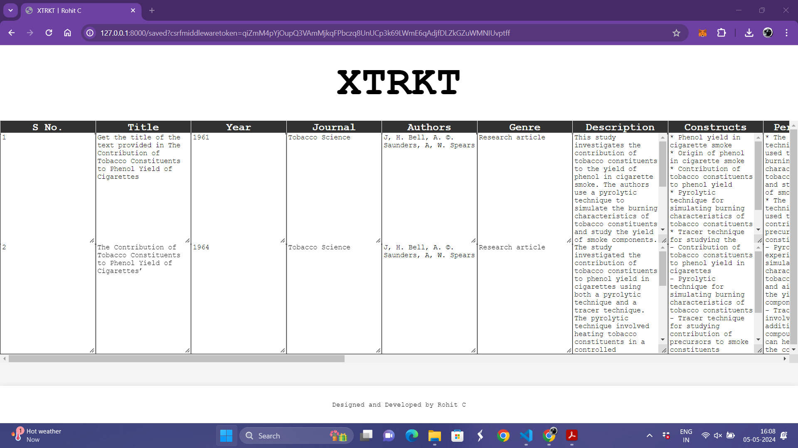

Thus XTRKT brings forth a seamless integration of AI, Prompt engineering, Web development and Database management to provide the user with the best results for a variety of datasets.

## Technology Stack
- The project the built using the Django Model-View-Template(MVT) Architecture for full stack web development.
- Tesseract module is being used for text detection from images.
- Google Gemini 1.0 Pro API is used for prompting.
- A local MySQL database is used to store the data extracted through prompts.

## Where to Look

- Refer the 'views.py' file in the task folder to get a well documented code of the backend.
- Refer the 'templates' folder to see the HTML pages developed for this project.
- Refer the 'media' folder to view sample dataset and the excel sheet generated for it.
- Refer the '.env' file to know the list of environment variables and API keys required to run this code.
- Install the requirements.txt using the command 'pip install -r requirements.txt'.
- Run the project using the command 'py manage.py runserver'

Regards,

Rohit C.
